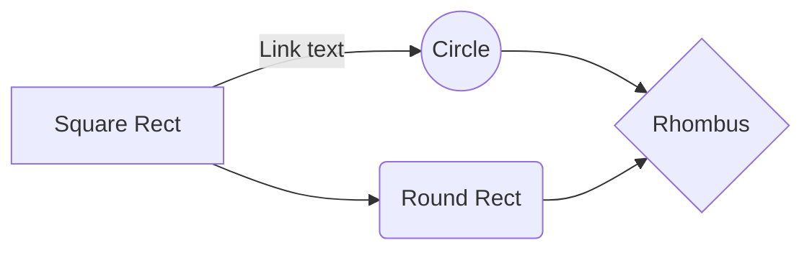

# TITLE
This is the repo for the project of the course Applied Data Analysis at EPFL [(CS-401)](https://dlab.epfl.ch/teaching/fall2022/cs401/).

## Team:
The `4ADA` team is composed by:
- Riccardo Brioschi: [@RiccardoBrioschi](https://github.com/RiccardoBrioschi)  
- Federico Di Gennaro: [@FedericoDiGennaro](https://github.com/FedericoDiGennaro)  
- Lazar Milikić: [@LazarMilikic](https://github.com/Lemmy00)  
- Maja Skoko: [@MajaSkoko](https://github.com/s-maja)

## Abstract: 
2020 was a year of big changes in the world. During the coronavirus pandemic, more than 4M people were infected and more than 15K people died. Because of reduced mobility during that period people started to live in an ‘online’ world, expressing their thoughts and opinions on social media like Twitter. Wikipedia also had a big role during that period as the main source for investigating more about viruses, and previous pandemics, but also about different topics for which earlier they didn't have enough free time to explore.
The goal of this project is to use human digital traces to understand how the pandemic has impacted human needs and interests.

## Research questions:
Starting from West et al.’s work about attention shifts on Wikipedia during the COVID-19 crisis, we want to retrieve additional information from Twitter in order to answer the following questions:

1) How have people's interests in different topics on Wikipedia and Twitter changed during different periods of the pandemic in different countries? Is there any correlation between these two? Do tweets reflect the same changes in volume and nature of information seeking as shown by Wikipedia pageview logs? Do COVID-19-related tweets have a distribution similar to one of Wikipedia pages, with peaks and sudden increases around mobility changepoints?

2) Did influential people post more negative or positive messages using Twitter? Did this reflect the situation going on in each country (e.g., regarding the topics searched, interests in COVID, respecting governments' lockdown measures, and general mobility)?

3) Did countries with a higher presence of COVID on tweeter and interest before the lockdowns (or if no official lockdowns in the country, we could detect the points of high-reduction of mobility, a kind of alternate normalcy feature from Coronawiki) have a better COVID situation than countries that didn’t?

## Datasets:
To answer those questions we used the following datasets:
- `Global_Mobility_Report` (given): in this dataset are collected all the metrics regarding mobility.
- `aggregated_timeseries` (given): here we find the date and the number of clicks on wikipedia pages of different topics (e.g. Covid, Geography, STEM, ...)
- `interventions` (given): in this dataset we can find all the date of the most important events during the pandemics for some countries.  
- `WHO-COVID-19-global-data`(added by us): dataset downloaded from the official website of World Health Organization [(here)](https://covid19.who.int/data). We have decided to add this dataset to have a better understanding in our analysis on how pandemics was going.

## Methods:
**RQ1**: We want to analyze which were the most discussed topics on Twitter during the pandemic, in order to verify whether users’ behavior has been similar between Wikipedia and the social network. Since we are interested in comparing the data from Twitter with the results obtained by West et al., there is no need to adopt a difference-in-difference methodology but it is enough to compute the frequency with which the topics of the ORES article topic were mentioned in different tweets. For what regards COVID-19-related tweets, it might be interesting to compare their daily or weekly distribution with the daily or weekly distribution of deaths in each country (WHO dataset), in order to see whether a higher number of posts about the virus might be a symptom of the gradual worsening of the situation.  
**Methodology 1**: We import tweets for each one of the 12 countries using Twitter API. Tweets may be retrieved on a daily or weekly basis at particular times of the day (moments of major usage of the platform). In order to label each tweet with a topic, we use ........................... which performs well with a wide variety of languages. To compare Twitter results with Wikipedia pageviews, various data visualization techniques may be adopted.

**RQ2**: We retrieve tweets posted by influential people in each country (politicians, influencers, public figures from music, sports, etc.) and we perform a sentiment analysis of these posts using Google API. We compute both a sentiment score and a magnitude value for each comment. The latter, which refers to the semantic power of the words appearing in the tweet, might also be useful to understand the way communication has changed during the pandemic and which were the most used words.  
**Methodology 2**: We retrieved a sufficient amount of tweets published by 10 influential people in each country. The nature of the posts can be of different kinds (Covid, Vaccination, etc)  and the posting dates should be uniformly distributed throughout the pandemic period. We then analyze the time series of the obtained sentiment values with mobility data and deaths data (WHO Dataset)

**RQ3**: We can finally observe whether famous people influenced people’s mobility (using panicking words, warnings etc) before and after official limitations were published and see if stronger words were used in countries having the strongest lockdown.  

## Proposed timeline:

|Period                         |Tasks                        |
|-------------------------------|-----------------------------|
|`November 21st - November 27th ` |TBD                          |
|`November 28st - December 04th ` |TBD                          |
|`December 05th - December 11th ` |TBD                          |
|`December 12th - December 18th ` |TBD                          |
|`December 19th - December 23th ` |TBD                          |

## Organization within the team:
- [@RiccardoBrioschi](https://github.com/RiccardoBrioschi):   
- [@FedericoDiGennaro](https://github.com/FedericoDiGennaro):  
- [@LazarMilikic](https://github.com/Lemmy00):  
- [@MajaSkoko](https://github.com/s-maja):  

