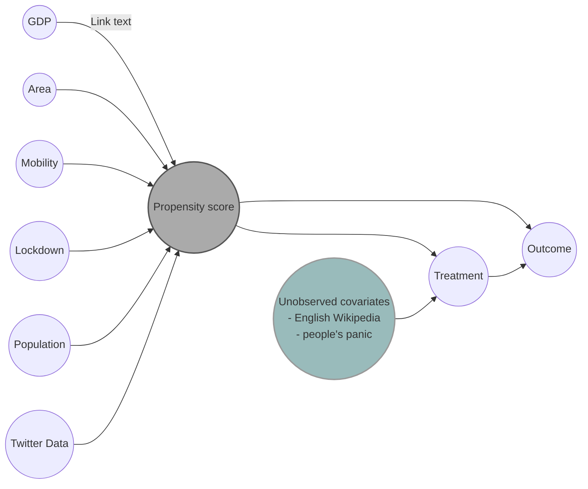

# Importance of *online world* during the coronavirus pandemic 
This is the repo for the project of the course Applied Data Analysis at EPFL [(CS-401)](https://dlab.epfl.ch/teaching/fall2022/cs401/).

## Abstract
Due to the coronavirus pandemic, year 2020 was a year of big changes in the world. Because of reduced mobility during that period people started to live in an ‘online’ world, expressing their thoughts and opinions on social media like Twitter. Additionally, they used Wikipedia, the largest and most-read online encyclopedia, as the main source for investigating more about anything they would like to know. 

Starting from West et al.’s work about attention shifts on Wikipedia during the COVID-19 crisis [[1]](#References), this project aims to analyse human digital traces and to understand how the pandemic has impacted human interests, with particular attention to how communication has been affected by the virus. To reach this goal, we are analysing which topics people were interested in the most during the pandemic, both on Twitter and Wikipedia. Moreover, we want to investigate how interest in some topics was affected by influencing people on Twitter. And finally, to wrap up the story, we want to check if countries with a higher presence of covid topics, both on Twitter and Wikipedia, had an impact on the number of new cases and deaths based on different observed covariates.

## Research questions

To figure out how people's interests changed in response both to the disease itself and to the massive mobility restrictions during pandemic, we ask following questions:

1) How people's interest in different topics on Wikipedia and Twitter changed in the early stage of the pandemic in different countries? Do tweets reflect the same changes in nature of information seeking as shown by Wikipedia pageview logs?

2) What was the behavior of influential people on Twitter during pandemic, and how they impacted people's mobility during that period, with particular attention to the early stage of pandemic?

3) Did countries with a higher presence of covid related topics on Wikipedia and a higher presence of tweets about covid, mostly from influential people, have a better situation in terms of new cases and the number of deaths, than countries that didn’t?

## Datasets
To answer those questions we used the following datasets:
- `Global_Mobility_Report` (given): in this dataset are collected all the metrics regarding mobility.
- `aggregated_timeseries` (given): here we find the date and the number of clicks on wikipedia pages of different topics (e.g. Covid, Geography, STEM, ...)
- `interventions` (given): in this dataset we can find all the date of the most important events during the pandemics for some countries.  
- `WHO-COVID-19-global-data`(added): dataset downloaded from the official website of World Health Organization [(here)](https://covid19.who.int/data). We have decided to add this dataset to have a better understanding in our analysis on how pandemics was going.
- `Twitter data` (added): we are collecting tweets (both from influencing people and normal daily users) in different periods of the pandemic to get answers on mentioned RQs.
- `countries.csv` (added): dataset containing additional information about analysed countries, e.g. area, GDP, population etc.

## Methods

In this section, we will give an overview of the preprocessing, processing, and the data analysis part which needs to be done to answer on RQs. Moreover, we will explain the problem-solving process as well as the feasibility of each task.

#### Analysis of Wikipedia usage and tweets from *normal* daily users  

We want to analyze which were the most discussed topics on Twitter in the early stage of the pandemic, in order to verify whether users’ behavior has been similar between Wikipedia and the social network. Since we are interested in comparing the data from Twitter with the results obtained by West et al.[[1]](#References), there is no need to adopt a difference-in-difference methodology but it is enough to compute the frequency with which the topics of the ORES article topic were mentioned in different tweets. Additionally, this first analysis serves as an introduction to understand which topics have been discussed on Twitter: we want to detect whether the idea of a medical emergency started to arise in the discussed topics in order to identify which countries immediately began to pay attention to the virus.
 
For what regards our methodology, for this milestone we imported tweets from two countries (Serbia and Italy, our homelands) and we are currently retrieving data about the remaining countries: our goal is to conduct this analysis on each one of the countries presented in CoronaWiki dataset. We are retrieving tweets posted during the 3 weeks preceding the lockdown in each country because we want to study what was the initial response of the population to the inusual situation. For future purposes, we can expand the analysed period to see how people's behaviour has evolved during time. To make our analysis more convenient, we are translating each tweet from its original langugage to english using google translator python library. During process of retrieving tweets, we are avoiding retweets and tweets which contains videos, images or similar media since for our analysis only text is useful. Tweets are retrieved on a daily basis at particular times of the day (moments of major usage of the platform). In order to label each tweet with a topic and emotions, we use empath library. To compare Twitter results with Wikipedia pageviews, various data visualization techniques may be adopted.

#### Analysis of tweets from influential people - the power of communication during the pandemic

In this part of analysis, we are retrieving tweets posted by influential people in each country (politicians, influencers, public figures from music, sports, etc.). We adopted an approach similar to the one used for the previous task, translating each retrieved tweet to english in order to simplify our analysis. Since we are analysizng a limited number of users, in this part we can retrieve all tweets from the period of interest (3 weeks before lockdown). In order to label each tweet with a topic and emotions, we use empath library. Additionally, we perform a sentiment analysis of tweets using TextBlob library. We compute both a sentiment (polarity) score and a subjectivity value for each comment. We then try to quantify whether these tweets were meant to warn the population by looking at the most used words and hastags. This last analysis might also be useful to understand the way communication has changed during the pandemic. Notice that some the insights obtained at the end of this tasks are going to be considered as observed covariates for the following analysis.

####  Causality among covid related topics on Wiki and Twitter and covid new cases/deaths

We want to explore whether an overall interest in COVID-19 had impact on reducing/slowing number of new cases and deaths in different countries. By overall interest we mean number of COVID-related pageviews on Wikipedia (which represent people's generla interest in the pandemic) and Twitter data of influential people (which represent the presence of the virus in social media).

We try to emulate a sort of observational study dividing each country in the following classes:
- treated: countries which proved to pay attention to COVID in the early stage of the pandemic;
- controlled: countries not showing particular interest in COVID-19. 
The actual way to assign a class to each country is better described in the corresponding notebook.

The causal graph below shows explain our analysis:

#### Feasibility

We have licence for 60M tweets, it is around 2GB of data which is apropriate amount of data for our machines with 16GB of RAM memory. 
We are using models... explain why we are safe to use them.

## Proposed timeline

|Period                           |Milestones                              |
|---------------------------------|----------------------------------------|
|`November 21st - November 27th ` | Twitter data retrieval & answering RQ1 |
|`November 28st - December 04th ` | Answering RQ2                          |
|`December 05th - December 11th ` | Focusing on RQ3                        |
|`December 12th - December 18th ` | Overall conslusion & Data story        |
|`December 19th - December 23th ` | Final checks and revisions             |

## Organization within the team

|Task                        |Responsibility *             |
|----------------------------|-----------------------------|
|Wikipedia usage & tweets from *normal* daily users | R, F |
|Tweets from influential people                     | M, R |
|Causality Twitter/Wiki to new cases                | L, M |
|Mobility & WHO data analysis                       | F    |

*M = Maja, F = Federico, L = Lazar, R = Riccardo

## Authors

The `4ADA` team is composed by:
- Riccardo Brioschi: [@RiccardoBrioschi](https://github.com/RiccardoBrioschi)  
- Federico Di Gennaro: [@FedericoDiGennaro](https://github.com/FedericoDiGennaro)  
- Lazar Milikić: [@LazarMilikic](https://github.com/Lemmy00)  
- Maja Skoko: [@MajaSkoko](https://github.com/s-maja)

## References

[1] West R. et al.,  "Sudden Attention Shifts on Wikipedia During the COVID-19 Crisis", 2020 https://arxiv.org/pdf/2005.08505.pdf 
